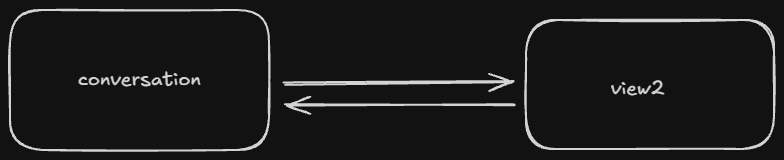

### HW1 description

Big font:

Small font:

### HW2 description

The essential parts for implementing navigation are a navigation host and controller. You can make a
button that takes you to another view in the app by calling the controller's navigate function when
clicking the button. Circular navigation can be prevented by using `popBackStack()` instead of
`navigate()`, or by specifying `popUpTo()` and `inclusive` in the navigate call.

#### Extra:

Users are expected to spend most of their time in the conversation view, since there is nothing to
do in view2. It takes one step to access the conversation view. I have already streamlined the
process of getting to the conversation view, since the only step required to get there is opening
the app.

### HW3 description

I implemented picking an image using the `PickVisualMedia` activity and allowed only selecting
images. Text input was implemented with the state-based TextField to try out the new recommended
approach. I had to update my composeBom, since the old version only supported value-based text
fields. The image is just saved to a file called `profile_picture` in the app's filesDir, and is
loaded as soon as the app starts. The text is stored in a Room database which is accessed on a
background thread to prevent blocking the UI.

#### Extra:

I'm only storing the username in the database of my app. It's expected to take up about 4-16 bytes
depending on the length of the username, and a few bytes more if we take into account whatever other
data the SQLite database requires to function. Additionally, whether the messages have been read
could also be stored in the database or for example whether dark mode is enabled if such a setting
was added. 