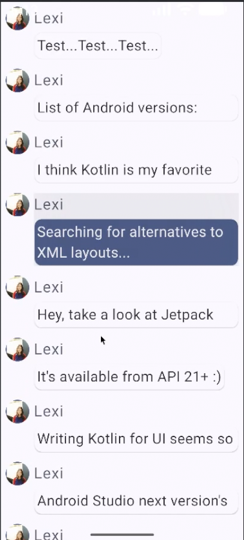
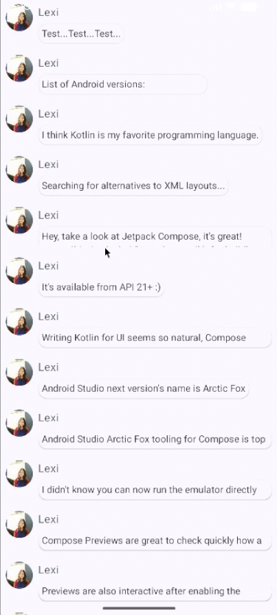

## HW1 description

I added the image with the resource manager and adjusted its size and shape with the `.size()` and
`.clip()` modifiers. I changed the text appearance with the Material typography styles. I made the
content scrollable by adding items to a LazyColumn. I registered the user click by using the
`.clickable` modifier and updating state of `isExpanded`. This causes visible change in the message
since that uses the state of `isExpanded`, for example for the value of `maxLines` for the text.

#### Extra

Big font:

Small font:

## HW2 description

The essential parts for implementing navigation are a navigation host and controller. You can make a
button that takes you to another view in the app by calling the controller's navigate function when
clicking the button. Circular navigation can be prevented by using `popBackStack()` instead of
`navigate()`, or by specifying `popUpTo()` and `inclusive` in the navigate call.

#### Extra:

Users are expected to spend most of their time in the conversation view, since there is nothing to
do in view2. It takes one step to access the conversation view. I have already streamlined the
process of getting to the conversation view, since the only step required to get there is opening
the app.

## HW3 description

I implemented picking an image using the `PickVisualMedia` activity and allowed only selecting
images. Text input was implemented with the state-based TextField to try out the new recommended
approach. I had to update my composeBom, since the old version only supported value-based text
fields. The image is just saved to a file called `profile_picture` in the app's filesDir, and is
loaded as soon as the app starts. The text is stored in a Room database which is accessed on a
background thread to prevent blocking the UI.

#### Extra:

I'm only storing the username in the database of my app. It's expected to take up about 4-16 bytes
depending on the length of the username, and a few bytes more if we take into account whatever other
data the SQLite database requires to function. Additionally, whether the messages have been read
could also be stored in the database or for example whether dark mode is enabled if such a setting
was added.

## HW4 description

The post notifications permission is checked with `ContextCompat.checkSelfPermission()` and
requested with `ActivityResultContracts.RequestPermission()`. The app creates a foreground service
which sends a notification in the background if motion is detected. Android docs says gyroscope
can't be used normally if the app is in the background hence the foreground service. An intent is
added to the notification with `putExtra("navigate_to, ...)` which tells the app which screen to
navigate to. I'm using the gyroscope for sending the notification and the light meter to display
light level in the sensors screen for fun.

#### Extra:

I'm using the gyroscope and light sensor. If they aren't available on the device the app still works
but the sensors just report 0 for all values. I also verified this by removing the sensors from the
virtual device. The app doesn't require internet connection.

---

## Project description

#### Add new entries to database

New messages can be sent in the conversation view, and they will be stored in the Room database.

#### Using an API

Amount of free parking spaces in Kivisydän is displayed with the Oulu graphql traffic api.

#### Check and grant permission in runtime

Notification permission can be granted in runtime with button and the state of whether the
permission has been granted is displayed below.

#### Microphone functionality

Audio can be recorded and played back